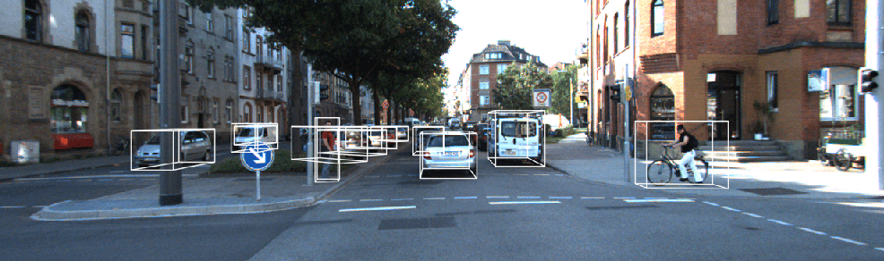
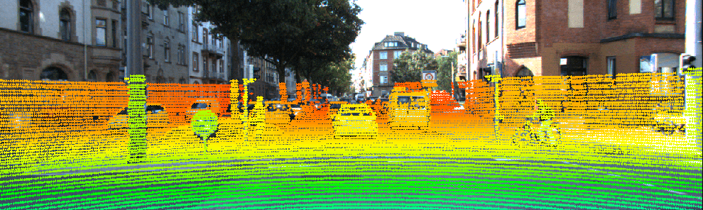
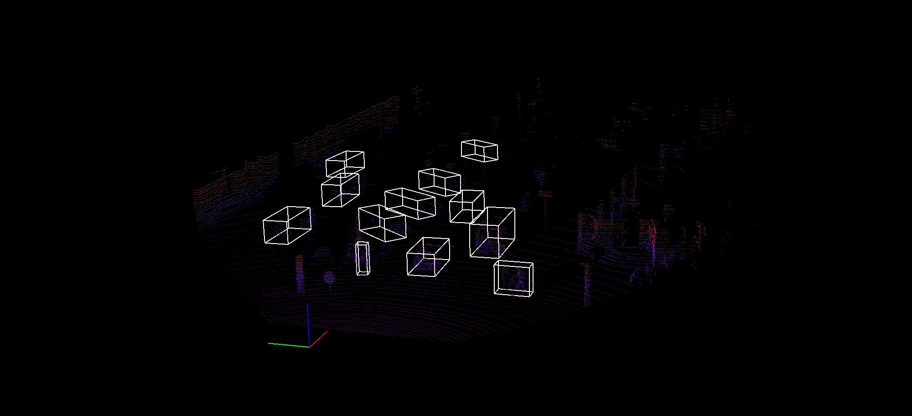

# Lidar-Camera Projection
This code is used to explain the post [here](https://medium.com/@daryl.tanyj/camera-lidar-projection-navigating-between-2d-and-3d-911c78167a94).

## Dependency Installation
Assuming you have installed anaconda. Get all dependencies with
```
conda env create -f requirement.text 
```

## How to use
```
python lidar_camera_project.py
```

#### Image 3D boxes


#### Lidar Points Image


#### Lidar 3D boxes

