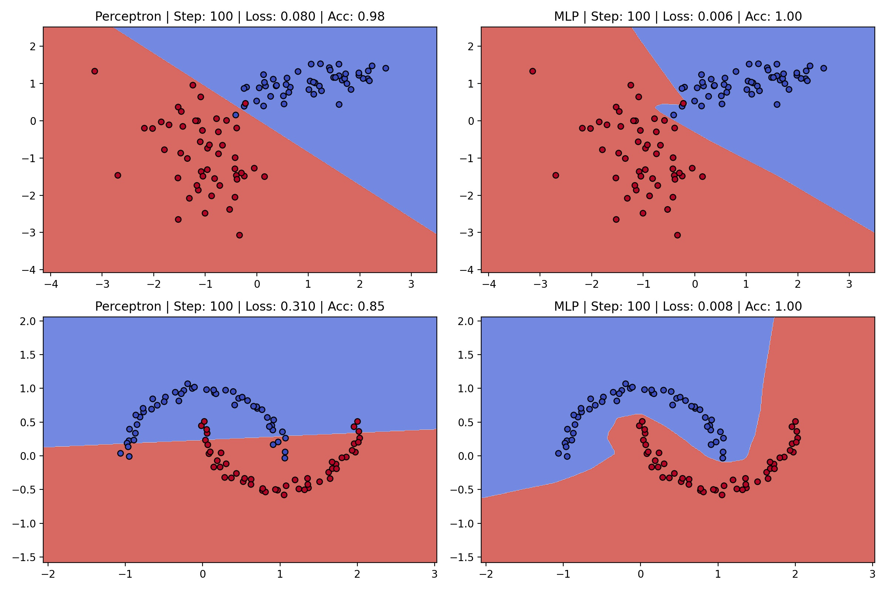
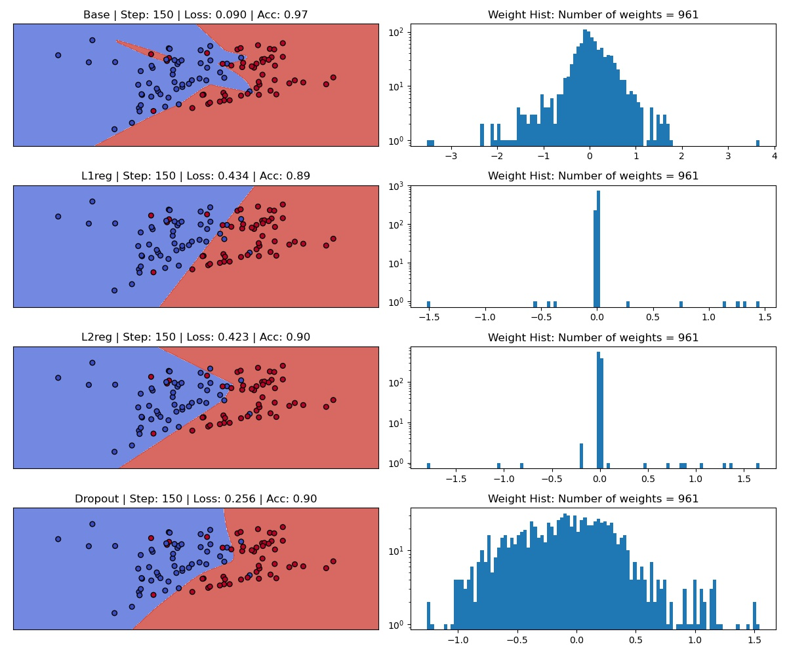
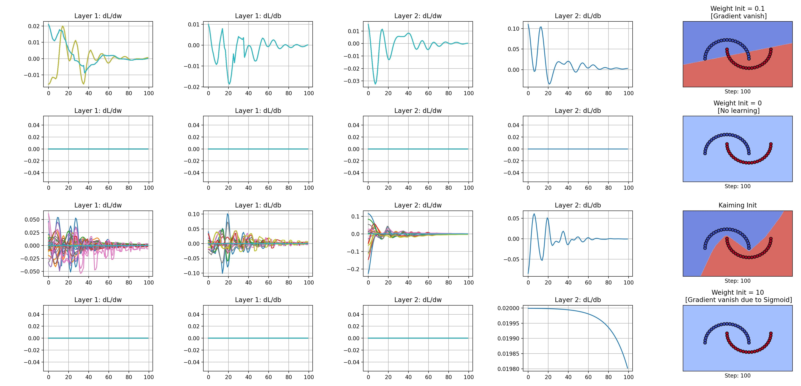

Code snippets on ML fundamentals

### Requirement
PyTorch + Anaconda packages

### Topics
- [Activation Function](non_linear_activation.py)

    Plot activation functions along with gradient to determine where gradient is meaningful and where it vanishes.
    
- [Logistic Regression](logistic_regression.py)
    
    A simple comparison between perceptron and MLP on toy datasets.
    Shows the evolution of the decision boundary.

        
    
- [Over fitting/Regularization](overfit_regularize.py)
    
    Test the effect of regularization on weights.
    
    Note: L1/L2 induce sparsity with greater effect in L1. Connection weights -> 0, deactivating neurons. Reducing overfitting.

        

- [Weight Initialization](weight_init.py)
    Careful weight initialization schemes prevents vanishing or exploding gradient.

    More info: https://www.deeplearning.ai/ai-notes/initialization/       

        
